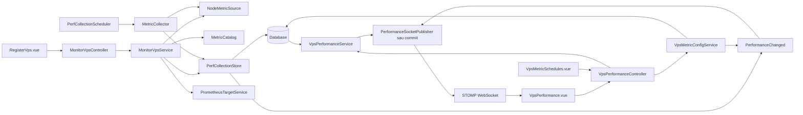

# Thu thập perf theo VPS, metric và object

## Event theo giá trị perf

Mở **Monitoring Server → Event VPS** ở sidebar (`/staff/monitoring/vps/events`), chọn VPS và metric. Màn riêng hiển thị **Cấu hình event** và **Event của metric** ngay trên trang. Có thể tạo/sửa/xóa rule, bật/tắt, chọn **một object** hoặc **tất cả object**, đặt ngưỡng `>`, `≥`, `<`, `≤`, mức độ Minor/Warning/Critical/Fatal và số mẫu liên tiếp (1–100). Mỗi metric trên một VPS hỗ trợ tối đa 100 rule. Có thể đặt nhiều ngưỡng bằng nhiều rule. Link **Event VPS** từ màn hiệu năng chuyển sang trang mới, giữ VPS/metric đang chọn; không mở popup event hay hiển thị danh sách event trong màn hiệu năng.

Ví dụ CPU `≥80%`, 2 mẫu liên tiếp, phạm vi tất cả object: CPU 0 và CPU 1 có bộ đếm/trạng thái riêng; CPU phát hiện thêm về sau tự áp dụng rule. Không lấy tổng/trung bình của các object. Với MEMORY_USAGE/LOAD_1M/UPTIME và các metric MySQL không có object riêng, tên metric được hiển thị làm tên object; khóa `vps` và `object_id=null` vẫn được giữ để lịch sử/rule cũ tiếp tục hoạt động. `all` đánh giá chuỗi metric đó.

Event có đúng 4 mức độ tăng dần: **Minor → Warning → Critical → Fatal**, phân biệt bằng màu. Bảng lịch sử có cột Mức độ riêng với trạng thái Phát sinh/Hồi phục; event hồi phục vẫn giữ cấp độ của rule.

Dữ liệu `INFO` cũ được `EventSeverityConverter` đọc thành `MINOR` cho cả rule và history, tránh lỗi khi đọc lịch sử. Bản ghi mới chỉ dùng 4 giá trị hiện tại. Cột severity dùng VARCHAR(10) qua JPA converter; môi trường cũ dùng MySQL ENUM cần chạy [sql/monitor-event-severities.sql](sql/monitor-event-severities.sql) trước khi chạy phiên bản mới để mở rộng kiểu cột và chuyển `INFO` thành `MINOR`. Script giữ nguyên rule/state/history và các mức WARNING/CRITICAL; chưa chạy trên DB thật.

- Rule ở `monitor_event_rule`; trạng thái từng rule/object ở `monitor_event_state`; lịch sử ở `monitor_event`.
- `PerfCollectionStore` gọi `MonitorEventService.evaluate` sau khi tính và lưu giá trị perf hợp lệ, trong cùng transaction và dưới khóa VPS. Cấu hình rule cũng khóa VPS; collector và thao tác chỉnh rule không tạo trạng thái trùng. Rule không thay đổi schedule thu thập.
- Đủ số mẫu thỏa điều kiện sẽ ghi `ALERT` một lần. Mẫu tiếp tục thỏa ngưỡng không ghi event lặp. Mẫu hợp lệ đầu tiên không còn thỏa điều kiện ghi `RECOVERY`, trỏ đến `openedEventId` của cảnh báo tương ứng. Sau hồi phục, một đợt mới có thể phát cảnh báo mới.
- Warmup, counter reset, NaN/Infinity, object biến mất hoặc thu thập lỗi không phát cảnh báo/hồi phục. Chúng ngắt bộ đếm đang chờ; khoảng cách giữa mẫu lớn hơn `2 × chu kỳ + 10 giây` cũng ngắt bộ đếm. Cảnh báo đang mở vẫn giữ trạng thái khi mất dữ liệu, chỉ hồi phục khi có mẫu hợp lệ bình thường. Mẫu trùng timestamp hoặc cũ hơn mẫu đã đánh giá không được tính lại.
- Trạng thái và cảnh báo được giữ qua restart. Rollback lưu perf đồng thời rollback event/state; socket chỉ gửi sau commit. Snapshot/socket hiện có thêm `events` (50 event mới nhất của VPS/metric). History perf không tải lại event. Không cần topic/socket mới; quyền vẫn STAFF/ADMIN.
- Bên dưới phần cấu hình trên màn **Event VPS** là danh sách event với object, giá trị thực tế, điều kiện, mức độ, thời gian và liên kết hồi phục; **Xem event cũ hơn** tải tiếp bằng cursor ID. Màn mới dùng socket hiện có để nhận event; reconnect tải lại snapshot và event từ DB. Đổi VPS/metric hủy request và subscription cũ, bỏ qua response/frame đến muộn. Trong lúc lưu rule, khóa bộ chọn và chuyển trang để tránh mất kết quả thao tác.
- Sửa/tắt/xóa rule reset trạng thái/bộ đếm, giữ lịch sử có snapshot tên rule, ngưỡng, object và giá trị cũ. Đây là thay đổi cấu hình, không tạo `RECOVERY` giả; áp dụng cho mẫu hợp lệ tiếp theo, không đánh giá lại perf lịch sử. Không có gửi email hay thông báo ra ngoài.
- Event được giữ độc lập với retention perf; hiện chưa tự xóa lịch sử event. Giới hạn simple broker nhiều instance đã nêu bên dưới vẫn áp dụng.

Restart staff-service sau cập nhật để tạo 3 bảng mới bằng `ddl-auto=update`. Môi trường dùng migration có script thêm bảng ở [sql/monitor-events.sql](sql/monitor-events.sql). Script chưa được chạy trên DB thật; kiểm thử dùng H2/MySQL mode, cần kiểm tra migration trên MySQL của môi trường trước triển khai. Các bảng/perf/schedule cũ không bị xóa hoặc chuyển đổi.

Nếu build từng module bằng Maven, build/install `common-security` trước `staff` để tránh dùng jar cũ trong `.m2` (jar cũ dùng Keycloak role converter sẽ trả 403 với JWT có claim `roles`). Từ thư mục workspace: `.\staff\mvnw.cmd -f common-security/pom.xml install`, sau đó `.\staff\mvnw.cmd -f staff/pom.xml package`. IntelliJ cũng cần dùng module `common-security` hiện tại.

REST API mới (STAFF/ADMIN), prefix `/api/staff/vps/{vpsId}/metrics/{code}`:

- GET `/event-rules`: cấu hình và số object đang cảnh báo tại thời điểm đọc.
- POST `/event-rules`, PUT `/event-rules/{ruleId}`: `{name, objectKey, operator, threshold, severity, consecutiveSamples, enabled}`. `objectKey` là `all`, `vps` hoặc ID object; server xác minh object/rule thuộc đúng VPS/metric. Operator `GT/GTE/LT/LTE`, severity `MINOR/WARNING/CRITICAL/FATAL` (hiển thị Minor, Warning, Critical, Fatal); threshold phải hữu hạn.
- DELETE `/event-rules/{ruleId}`: xóa cấu hình và trạng thái, giữ lịch sử.
- GET `/events?beforeId=<event_id>`: tối đa 50 event mới nhất hoặc cũ hơn cursor; ID giảm dần.

`MonitorEventController` xử lý HTTP và quyền; `MonitorEventService` quản lý rule, đánh giá và đọc event; ba entity/repository lưu cấu hình/trạng thái/history. Frontend dùng `monitorEventService.ts`, editor inline `MetricEventRules.vue` và `VpsEventHistory.vue`; màn `VpsEvents.vue` chọn VPS/metric, đọc DB và nhận event qua snapshot/socket. `StaffSidebar.vue` có menu riêng, route kế thừa quyền STAFF/ADMIN của layout staff. Màn `VpsPerformance.vue` chỉ có link chuyển sang màn event.

Luồng: đăng ký máy chủ → đọc Node Exporter hoặc Windows Exporter và lưu loại exporter → lưu máy chủ, metric assignment và object trong một transaction → scheduler đọc lịch trong DB → đọc đúng exporter → lưu perf → API/UI đọc DB. Linux giữ 7 metric mặc định. Windows dùng CPU theo core, bộ nhớ, ổ đĩa theo volume, mạng theo NIC và uptime; không gán `LOAD_1M` vì Windows Exporter không cung cấp load average cùng nghĩa với Linux.

## Sử dụng

- Restart staff-service sau khi cập nhật. Cấu hình hiện tại dùng `spring.jpa.hibernate.ddl-auto=update`; Hibernate bổ sung bảng/cột mới. Không chạy ứng dụng test với DB thật.
- Khi service sẵn sàng, khởi tạo 7 metric mặc định nếu mã metric chưa tồn tại. Không ghi đè cấu hình metric đã có. Tự gán metric mặc định cho VPS cũ còn thiếu assignment; object của VPS cũ được khám phá trong lần thu thập thành công đầu tiên.
- Máy chủ đăng ký mới được kiểm tra đúng exporter trước khi lưu. Máy chủ, assignment và object cùng transaction. Hai file target Prometheus local được đồng bộ sau commit; lỗi ghi file không ngăn collector DB đọc exporter trực tiếp.
- Mở **Giám sát → Hiệu năng VPS**, hoặc **Xem danh sách VPS → Xem perf**. Chọn VPS, metric và object; mặc định xem 10 phút gần nhất, có thể đổi sang 1h/6h/24h/7 ngày.
- Phần **Cấu hình thu thập** cho phép bật/tắt và đổi lịch mặc định của metric, timeout hoặc lịch riêng trên VPS. `scheduleSeconds=null` trên assignment nghĩa là kế thừa lịch metric.
- CPU và network cần 2 lần thu thập; lần đầu chỉ lưu baseline. Không ghi 0 thay cho dữ liệu thiếu. Counter reset sẽ cập nhật baseline và bỏ mẫu chênh lệch không hợp lệ.

## Dữ liệu

Danh mục nằm ở `monitor_metric`; assignment/lịch/trạng thái tác vụ ở `monitor_vps_metric`; object ở `monitor_object`; giá trị lịch sử ở `monitor_perf_value`; baseline counter ở `monitor_perf_baseline`.

- CPU_USAGE: một object cho mỗi nhãn cpu; % = 100 × (1 − Δidle/Δtotal). Không cộng lại guest/guest_nice đã nằm trong user/nice.
- DISK_USAGE: một object cho mỗi cặp device + mountpoint, loại các filesystem tmpfs/devtmpfs/overlay/squashfs; dùng avail/size.
- NETWORK_RECEIVE/TRANSMIT: từng device, bỏ lo; bytes/s = Δcounter/Δthời gian giữa hai mẫu của metric.
- MEMORY_USAGE, LOAD_1M, UPTIME: metric toàn VPS, `object_id=null`.

Mọi mẫu perf và timestamp của scheduler dùng UTC. API trả epoch seconds; UI đổi sang múi giờ trình duyệt. Object không còn xuất hiện sau một lần đọc thành công được đánh dấu OFFLINE và giữ lịch sử. Lỗi mạng không đánh dấu toàn bộ object biến mất.

Collector hỗ trợ `NODE_EXPORTER`, `WINDOWS_EXPORTER` và `MYSQL_JDBC`. Bộ metric MySQL riêng được mô tả trong [hướng dẫn giám sát MySQL](mysql-monitoring.md). Metric khác trong DB cần bổ sung collector tương ứng; lỗi được lưu ở assignment và hiện trên UI. Không tự ghi đè các metric đã có để tránh thay đổi cấu hình ngoài ý muốn.

History được lọc theo VPS + metric + object tại DB. Khoảng tối đa 10 phút trả mẫu gốc; khoảng dài hơn lấy trung bình theo bucket để giới hạn khoảng 1000 điểm/chuỗi. Khoảng bị gián đoạn được thêm điểm null. Latest luôn trả thời gian mẫu và cờ stale; dữ liệu cũ không bị trình bày như mẫu mới.

## Cấu trúc sau refactor



| Class/component | Trách nhiệm |
| --- | --- |
| `MonitorVpsController` | List, discovery, register; chỉ STAFF/ADMIN; trả DTO thay vì serialize entity JPA. |
| `MonitorVpsService` / `IMonitorVpsService` | Kiểm tra trùng, nhận diện Node/Windows Exporter, lưu máy chủ + assignment + object + target trong transaction đăng ký. Metadata ưu tiên dữ liệu vừa đọc từ exporter. |
| `PrometheusTargetService` | Lưu target `node`, ghi file SD local khi service khởi động và sau commit. Không thực hiện thu thập perf. |
| `MetricCatalog` | Tạo các metric mặc định còn thiếu, gán các metric mặc định cho VPS. |
| `PerfCollectionScheduler` | Tìm assignment đến hạn, giới hạn 4 worker và chạy retention. |
| `MetricCollector` | Claim một assignment, gọi HTTP ngoài transaction ghi, chuyển kết quả/lỗi sang store. |
| `NodeMetricSource` | Bộ đọc/parser Node/Windows Exporter dùng chung cho discovery, registration và collection. |
| `PerfCollectionStore` | Lease, token, khóa DB, object, baseline, rate, perf, backoff và event thay đổi. |
| `VpsMetricConfigService` | Danh mục, cấu hình lịch mặc định/riêng, validate và phát event đổi cấu hình. Chỉ query assignment của metric liên quan khi đổi lịch mặc định. |
| `VpsPerformanceService` | Chỉ đọc snapshot/history từ DB, tính state/stale và khoảng gián đoạn. |
| `VpsPerformanceController` | Giữ nguyên URL perf/catalog/config cho frontend. |
| `PerformanceSocketPublisher` | Sau commit, đọc snapshot trong transaction mới và gửi đến topic của VPS/metric. |
| `PerformanceWebSocketConfig` / `PerformanceSocketAuthorization` | Endpoint STOMP, heartbeat, origin, quyền subscribe và thời hạn JWT. |
| `RegisterVps.vue` / `monitorVpsService.ts` | Form discovery/register, popup danh sách và HTTP tương ứng. |
| `VpsPerformance.vue` / `vpsPerformanceService.ts` | Snapshot + history 10 phút, chọn object và đồ thị; hủy request cũ, giữ/gộp mẫu socket khi history đang tải. |
| `vpsPerformanceRealtime.ts` | STOMP, kiểm tra frame/sequence, reconnect và yêu cầu HTTP resync. |
| `MetricScheduleDialog.vue` / `VpsMetricSchedules.vue` | Popup ở giữa và editor lịch; lưu thành công cập nhật cấu hình, tiếp tục nhận socket. |

Đã bỏ màn `ServerMonitoring.vue`, service trả dữ liệu mẫu `MonitoringService`, nhánh PromQL/cache trong `StaffServiceImpl`, các HTTP client/parser trùng và service metric/object không có caller. URL `/staff/monitoring` chuyển sang màn hiệu năng, giữ query của bookmark cũ. Sidebar chỉ còn các chức năng monitoring đang hoạt động.

Các bảng và dữ liệu monitoring hiện có được giữ nguyên; refactor không cần migration hay xóa lịch sử. Staff-service ghi file target trong thư mục Prometheus local; collector DB vẫn hoạt động độc lập với việc đồng bộ file này.

## Scheduler

4 worker, tối đa 4 tác vụ đang chờ/chạy; HTTP không nằm trong transaction ghi dữ liệu. Mỗi assignment được claim dưới khóa DB với lease/token. Tác vụ cũ không được ghi sau khi token đã thay đổi. Cấu hình mới áp dụng cho lần thu thập tiếp theo; baseline được lưu để giữ chuỗi counter sau restart.

Khi lỗi, assignment giữ nguyên mẫu cũ và thử lại sau ít nhất 60 giây, tăng dần tối đa 15 phút (không rút ngắn chu kỳ đã cấu hình). Thu thập thành công reset số lần lỗi. Chỉ ghi cảnh báo khi nội dung lỗi thay đổi. Thông báo kết nối bao gồm IP/port và phân biệt lỗi kết nối, DNS, timeout và HTTP.

Các metric dùng chung object (ví dụ network receive/transmit cùng `eth0`) khóa VPS và đọc object bằng khóa cập nhật trong transaction READ_COMMITTED, tránh tạo trùng object khi thu thập đồng thời. Có kiểm thử hai worker tạo cùng object; kiểm thử này dùng H2, không thay thế kiểm tra thực tế trên MySQL.

Các property tùy chọn dưới `monitoring.collection`:

```yaml
enabled: true
tick-ms: 1000
retention-days: 0
```

`retention-days=0` giữ toàn bộ perf. Nếu cấu hình số ngày >0, cleanup mỗi giờ xóa tối đa 10000 mẫu cũ/lần. Với nhiều VPS cần chọn retention và theo dõi kích thước bảng/index. Không có thao tác xóa lịch sử mặc định.

## Hiệu năng realtime và lịch thu thập

- Màn `/staff/monitoring/vps/performance` đọc snapshot/lịch sử ban đầu qua HTTP,
  sau đó nhận giá trị trực tiếp qua STOMP WebSocket. Không polling perf định kỳ.
  Khoảng mặc định là 10 phút gần nhất (DB lọc từ UTC hiện tại trừ 10 phút đến
  UTC hiện tại). Snapshot giữ giá trị mới nhất từng object; biểu đồ nối tiếp các
  mẫu socket, loại điểm đã ra khỏi cửa sổ và gộp theo timestamp để tránh trùng.
  Mẫu socket đến khi DB đang tải được giữ và gộp vào kết quả, không ghi đè mất mẫu.
  Với khoảng tối đa 10 phút, DB trả mẫu gốc và timestamp thu thập, không lấy
  trung bình theo bucket; khoảng dài hơn vẫn dùng bucket giới hạn số điểm.
- Nút “Lịch thu thập” trên màn hiệu năng mở popup, chọn sẵn VPS và metric đang
  xem để sửa nhanh: chu kỳ mặc định, timeout, bật/tắt hoặc chu kỳ riêng trên VPS.
  `null` khôi phục dùng lịch mặc định. Biểu đồ/socket tiếp tục cập nhật khi mở popup.
  Mục sidebar cũng mở popup; URL cũ `/staff/monitoring/vps/schedules` chuyển sang
  màn hiệu năng kèm popup. Escape/nút Đóng/click ngoài đóng popup và khôi phục cuộn.
- Socket handshake `/api/staff/vps-performance/ws` đi qua gateway với route
  `lb:ws://staff-service`. JWT lấy từ HttpOnly cookie qua bộ lọc hiện có; không
  đặt token trong URL hay localStorage. Cần restart cả gateway và staff-service.
- Client được subscribe `/topic/vps-performance/{vpsId}/{metricCode}` hoặc
  `/topic/vps-events/{vpsId}` với
  quyền STAFF/ADMIN. Chặn wildcard và client SEND. Socket đóng khi access JWT
  hết hạn; client refresh cookie qua HTTP trước khi nối lại.
- Chỉ gửi snapshot sau khi transaction thu thập hoặc thay đổi cấu hình commit.
  Lỗi thu thập cũng đẩy trạng thái và giữ mẫu cũ. Lỗi gửi socket không làm hỏng
  transaction đã commit. Payload gồm `sequence` và `performance` (latest từng
  object, lỗi, trạng thái, chu kỳ hiệu lực). Nối lại sẽ tải snapshot và lịch sử.
- Realtime phản ánh lịch thu thập: metric chu kỳ 30 giây có mẫu mới sau mỗi lần
  thu thập, không tự tăng tốc collector khi người dùng mở màn hình.

Origin mặc định `http://localhost:5173`; cấu hình
`monitoring.websocket.allowed-origins` / `MONITORING_WEBSOCKET_ALLOWED_ORIGINS`
với origin thực tế khi triển khai. Reverse proxy cần forward WebSocket Upgrade.
Simple broker hiện chạy trong một instance staff-service. Nếu chạy nhiều
instance staff-service, cần broker dùng chung và phân phối sự kiện sau commit
giữa các instance; sticky session riêng không đủ vì collector claim qua DB.

## Hai màn xem event

- Sidebar **Event realtime** mở `/staff/monitoring/vps/events/realtime`.
  Chọn một VPS, đọc 50 event gần nhất từ DB rồi nhận ALERT/RECOVERY của tất cả
  metric qua một topic `/topic/vps-events/{vpsId}`. Giữ tối đa 200 event trong
  màn; lọc metric/cấp độ trên bộ đệm này. Mỗi dòng có metric, object, ngưỡng,
  giá trị và đơn vị. Socket chỉ gửi event mới sau commit, không gửi toàn bộ lịch sử.
  Nối lại socket đồng bộ DB; đổi VPS/đổi màn hủy request và socket cũ.
- Sidebar **Lịch sử event** mở `/staff/monitoring/vps/events/history`.
  Chọn VPS, thời điểm bắt đầu/kết thúc, metric và cấp độ rồi bấm Tra cứu.
  Form dùng giờ trên máy, HTTP chuyển sang UTC; kết quả hiển thị lại giờ trên máy.
  Màn này không mở socket. Nút Xem thêm giữ nguyên bộ lọc đã tra cứu.
- GET `/api/staff/vps/{id}/events` nhận tùy chọn `metric`, `severity`, `from`,
  `to`, `beforeId`. `from`/`to` phải đi cùng nhau, dạng ISO Instant có múi giờ.
  Không truyền khoảng thời gian thì lấy event mới nhất. Trả `{events,nextCursor}`,
  50 dòng/trang; `nextCursor=null` khi hết. Sắp theo thời điểm thu thập giảm dần,
  rồi ID giảm dần, tránh mất event có cùng thời điểm hoặc mẫu đến muộn.
- Thêm index `idx_monitor_event_time(vps_id,collected_at,event_id)`. Hibernate
  `ddl-auto=update` tạo index; nếu quản lý schema thủ công dùng
  `docs/sql/monitor-event-time-index.sql`. Script chưa chạy trên DB thật.
- `VpsEventController` → `MonitorEventService.search` → `MonitorEventRepository.search`.
  `MonitorEventsChanged` → `MonitorEventSocketPublisher` đọc event đã commit,
  thêm thông tin metric và phát socket. FE dùng `VpsEventViewer.vue`,
  `EventTable.vue`, `monitorEventService.ts`, `vpsEventRealtime.ts`.

## REST API hiệu năng (ADMIN/STAFF)

- GET `/api/staff/vps-metrics`: danh mục từ DB.
- GET `/api/staff/vps/{id}/metric-configs`: assignment và cấu hình hiệu lực.
- PUT `/api/staff/vps-metrics/{metricId}/config`: `{scheduleSeconds, timeoutMs, enabled}`.
- PUT `/api/staff/vps/{id}/metrics/{code}/config`: `{scheduleSeconds, enabled}`.
- GET `/api/staff/vps/{id}/performance?metric=CPU_USAGE`: giá trị mới nhất của mọi object.
- GET cùng URL với `hours=24&objectKey=<object_id>`: lịch sử riêng; object toàn VPS dùng `objectKey=vps`.
- GET cùng URL với `minutes=10&objectKey=<object_id>`: 10 phút gần nhất. Không truyền đồng thời `hours` và `minutes`.

Chu kỳ hợp lệ 5–86400 giây; timeout 1000–30000 ms. Lấy history tối đa 168 giờ/lần. API đọc không tạo object hay thu thập thêm mẫu.

## Kiểm thử

Backend test dùng H2 riêng ở chế độ MySQL, fixture Node/Windows Exporter và mock HTTP; không truy cập hay thay đổi DB/VPS thật. Test xác minh đăng ký, ghi file target local, gán metric, baseline, rate, reset counter, đọc history, giữ mẫu khi lỗi, khóa tác vụ và schedule. Native query cần được smoke-test thêm khi triển khai trên phiên bản MySQL của môi trường.

Parser đọc định dạng text của cả hai exporter, hỗ trợ CRLF và nhãn escaped theo [Prometheus text format](https://prometheus.io/docs/instrumenting/exposition_formats/).
